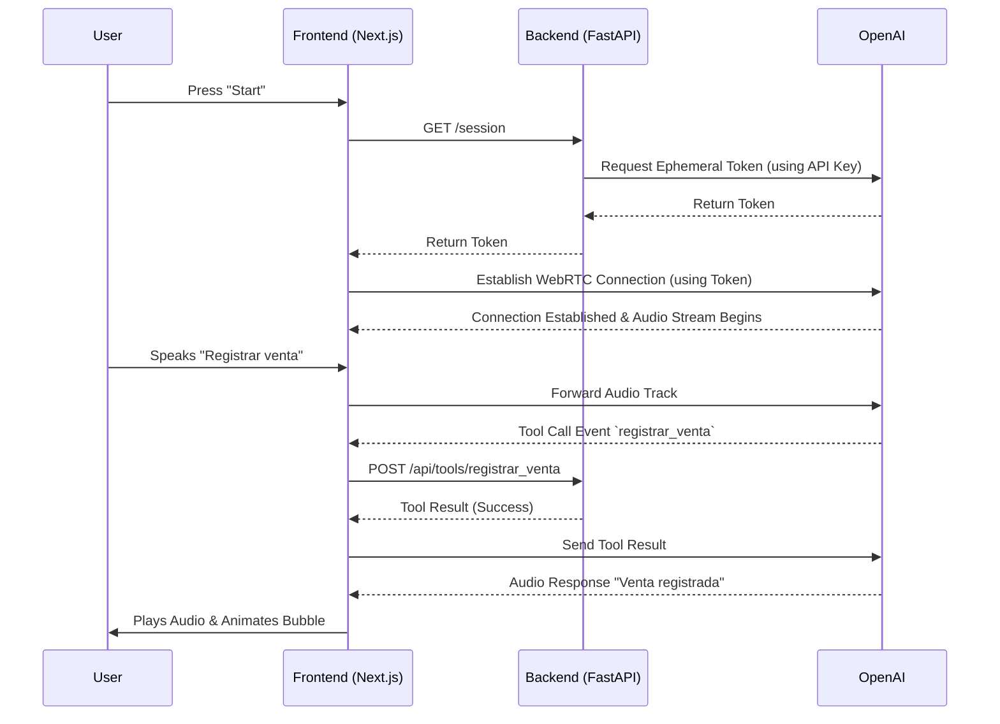

# Tu Caserito Voice Assistant - Frontend

This Next.js application serves as the frontend client for the Tu Caserito Realtime Voice Assistant.

## Features & Capabilities
*   **Realtime Audio Streaming:** Uses WebRTC and the `gpt-realtime-mini-2025-12-15` model to provide ultra-low latency conversational capabilities.
*   **Secure Ephemeral Tokens:** The frontend never exposes the OpenAI API key. It fetches a temporary, short-lived Ephemeral Token from the FastAPI backend to establish the WebRTC connection directly with OpenAI.
*   **Audio-Reactive UI:** Features a pure CSS animated "Water Drop" bubble that reacts to the audio frequency and amplitude of both the user's microphone and the assistant's voice, providing dynamic, organic visual feedback.
*   **Tool Execution:** Listens for `function_call` events over the WebRTC data channel and proxies tool executions (e.g., `registrar_venta`) to the backend.

## Architectural Decisions & Cost Optimization
1.  **WebRTC over WebSockets:** We chose WebRTC because it natively handles audio streaming, reduces latency, and runs efficiently in modern browsers without needing an intermediate audio processing server.
2.  **Model Selection (`gpt-realtime-mini-2025-12-15`):** The `mini` version of the realtime models is significantly faster and more cost-effective (approx. $0.60 per 1M input tokens, $2.40 per 1M output tokens) compared to the standard `gpt-4o-realtime-preview` ($5.00/$20.00), making it ideal for standard conversational tasks like registering inventory and sales.
3.  **Client-Side Connectivity:** By providing Ephemeral Tokens from the backend, the heavy lifting of the audio stream occurs directly between the client's browser and OpenAI's servers. This prevents bottlenecking our own backend bandwidth.

## Architecture Diagram



## Running the Application
```bash
npm run dev
```
Open `http://localhost:3000` in your browser.